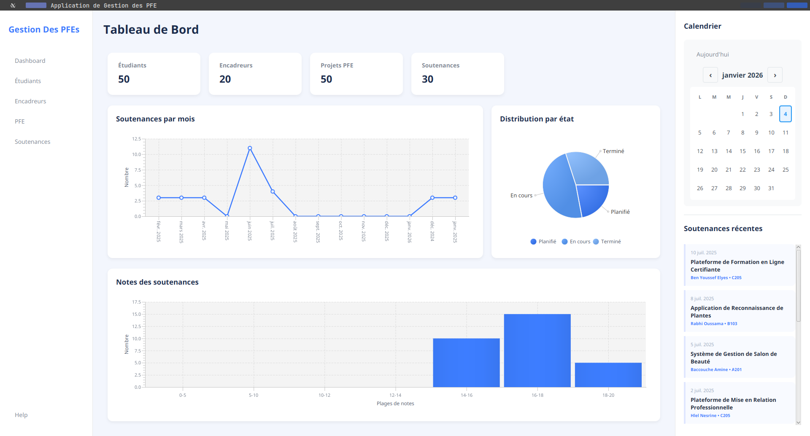

# Gestion des PFE

## Project Overview

Gestion des PFE is a Java-based application designed to manage student projects (PFE) efficiently. The application provides functionalities for managing students, supervisors, and project details, facilitating a smooth workflow for academic projects.

## Features

- **User Management**: Add, edit, and delete users (students and supervisors).
- **Project Management**: Create, update, and manage project details.
- **Soutenance Management**: Schedule and manage project defense sessions.
- **Dashboard**: Overview of all projects and their statuses.

## Technologies Used

- **Java**: The primary programming language for backend development.
- **JavaFX**: For building the user interface.
- **MySQL**: Database for storing user and project information.

## Project Structure

```

├── build.xml
├── manifest.mf
├── build/
│   ├── classes/
│   ├── controller/
│   ├── dao/
│   └── frontend/
│       └── ui/
│           ├── components/
│           └── controllers/
├── nbproject/
├── private/
├── src/
│   ├── backend/
│   ├── dao/
│   ├── frontend/
│   └── ui/
└── test/
```

## Installation

1. Clone the repository:
   ```bash
   git clone <repository-url>
   ```
2. Navigate to the project directory:
   ```bash
   cd Gestion_des_pfe
   ```
3. Build the project using Ant:
   ```bash
   ant build
   ```
4. Run the application:
   ```bash
   ant run
   ```

## Usage

- Launch the application and log in with your credentials.
- Navigate through the dashboard to manage projects and users.

## Contributing

Contributions are welcome! Please submit a pull request or open an issue for any suggestions or improvements.

## License

This project is licensed under the MIT License - see the [LICENSE](LICENSE) file for details.

## Contact

For any inquiries, please contact [Your Name](mailto:your.email@example.com).
